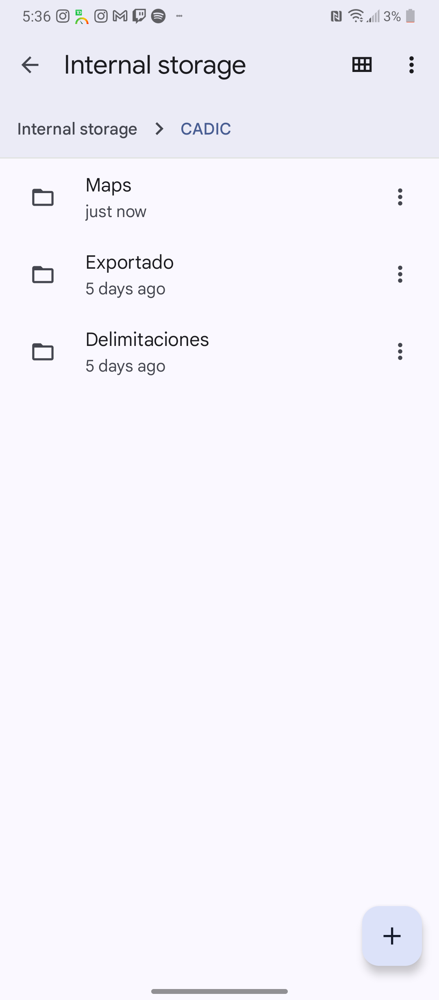
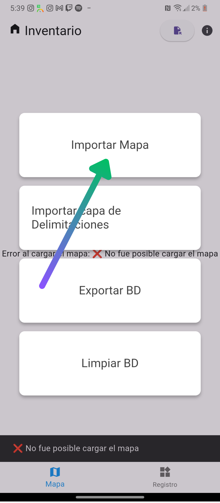
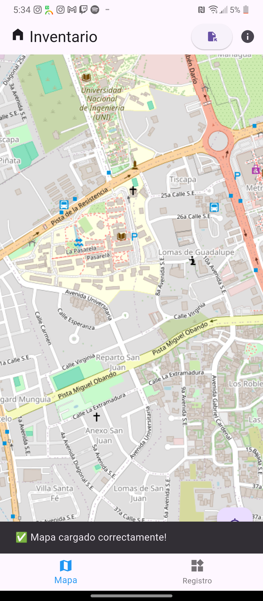

 

 
Inventario 

Manual para el usuario

<!-- TOC --> 

- [Instalación y primeros pasos](#instalación-y-primeros-pasos)
  - [Instalación](#instalación)
  - [Apariencia y Componentes básicos](#apariencia-y-componentes-básicos)
  - [Botones](#botones)
  - [Importación](#importación)
- [Uso del mapa](#uso-del-mapa)
- [Uso de los formularios](#uso-de-los-formularios)
  - [Subformularios](#subformularios)
  - [Rellenado](#rellenado)
  - [Guardado](#guardado)
  - [Edición](#edición)
  - [Eliminación](#eliminación)
  - [Sobrescritura de datos](#sobrescritura-de-datos)
- [Exportación de datos](#exportación-de-datos)
- [Solución a problemas comunes](#solución-a-problemas-comunes)
  - [Más de un mapa en la carpeta de mapas](#más-de-un-mapa-en-la-carpeta-de-mapas)
  - [Cambiar el nombre del encuestador](#cambiar-el-nombre-del-encuestador)
  - [No se muestran los predios en el formato correcto en el mapa](#no-se-muestran-los-predios-en-el-formato-correcto-en-el-mapa)

<!-- /TOC -->

# Instalación y primeros pasos
La aplicación se distribuirá a los usuarios encuestadores en dos versiones, una con un tamaño de alrededor de 200mb y la otra con alrededor de 26mb. Ambas versiones funcionan de igual manera, en lo único que difieren es en que la de mayor tamaño viene con un mapa de la ciudad de managua incluido dentro de la aplicación, por lo que al instalar esta versión, no hará falta importar el mapa por separado, en caso de poder conformarse con el mapa que trae originalmente. En lo que sigue se tratarán ambas versiones de la aplicación como la misma.

## Instalación
El proceso de instalación es bastante fácil, aunque en ocasiones, en versiones de Android puede incluir un paso extra de análisis o escaneo del archivo apk.
En las siguientes instrucciones interactivas, se explica a detalle con imágenes, el proceso de instalación.

<body>

    

        <button onclick="prevSlide()">Anterior</button>
        

        <button onclick="nextSlide()">Siguiente</button>
    

    

        

            
            
Aquí podemos apreciar la aplicación ya descargada. Presionamos sobre ella para comenzar 
                el proceso de instalación

        

        

            
            
Esperamos hasta que se instale la aplicación, debería aparecer una barra de carga informando
                el transcurso de la instalación.

        

        

            
            
Una vez terminada la instalación al ver un mensaje de confirmación, se puede continuar al proceso 
                de configuración. ya dentro de la aplicación.

        

        

            
            
Una vez instalada la aplicación debería aparecer en el dispositivo con el icono del logo de la aplicación.

        

        

            
            
Esta es la primera pantalla dentro de la aplicación. Esta pantalla solamente se verá la primera 
                vez que se entra en la aplicación.

        

        

            
            
 Una vez que se introduce el nombre del encuestador que operará 
                la aplicación en el dispositivo actual y se continúe, el nombre y los apellidos introducidos 
                quedarán registrados en la base de datos de la aplicación, y cada vez que se exporten los datos recogidos, 
                el nombre y los apellidos del encuestador serán adjuntados a esta base de datos exportada. Aunque se utilice la 
                herramienta "Limpiar Base de Datos", los datos del encuestador permanecerán intactos. Si se tiene algún problema con esto, consultar la sección <a href="#cambiar-el-nombre-del-encuestador">Cambiar el nombre del encuestador</a> 

        

        

            
            
Si se tiene la version de la aplicación que no incluye el mapa(la que pesa alrededor de 26 mb), 
                inicialmente la aplicación no tendrá mapa cargado y por ende se mostrará en lugar del mapa, este mensaje de error. 
                En los pasos siguientes se explica como cargar el mapa de manera adecuada.

        

        

            
            
Al entrar por primera vez en la aplicación, se crear una carpeta llamada 'CADIC' dentro del directorio raíz del dispositivo. 
                Esta contiene tres subcarpetas: 'Maps', 'Delimitaciones' y 'Exportado'. Este es el directorio que la aplicación tiene para 
                importar los recursos que necesita y exportar los datos recogidos, por lo tanto, en estas tres subcarpetas estarán el mapa 
                en formato de archivo con extensión '.mbtiles', las delimitaciones, cada una con extensión '.geojson', y última base de datos 
                exportada; en las carpetas 'Maps', 'Delimitaciones' y 'Exportado' respectivamente.
            

        

        

            
            
Para importar un mapa, se deberá proceder de manera manual, colocando el archivo con extensión '.mbtiles' que representa
                el mapa, en la carpeta 'CADIC/Maps' explicada en el paso anterior; o se podrá proseguir con una opción ofrecida dentro 
                de la propia aplicación que se encarga de dejar al usuario seleccionar el mapa del sistema de archivos del dispositivo 
                y automáticamente copiar el archivo para la carpeta adecuada. Para acceder a esta última opción, se deberá primero presionar 
                en el botón que despliega y agrupa las opciones de importación/exportación, este se podrá ver señalado en la imagen.
            

        

        

            
            
Aquí se pueden observar las opciones de importación/exportación de la aplicación. Aquí estarán las funcionalidades de 
                utilidad para importar un mapa, importar una capa de delimitaciones, exportar la base de datos y limpiar la base de datos. 
                En esta ocación utilizaremos la función de importar un mapa. Cuando esta opción es seleccionada, debería mostrarse el selector 
                de archivos del dispositivo, dando la opción de buscar el archivo del mapa de dentro del almacenamiento.
            

        

        

            
            
Luego de haber seleccionado el archivo del mapa desde el selector de archivos, debería salir un mensaje de confirmación de 
                importación en una barra auxiliar con fondo negro cerca de la parte inferior de la pantalla. Si esto no ocurre, es recomendable 
                copiar el mapa manualmente hacia la carpeta 'CADIC/Maps/'.
            

        

        

            
            
Después de haber importado el mapa con la funcionalidad en cuestión, debería haberse copiado y quedado en la carpeta 'CADIC/Maps/' 
                como se muestra en la imagen.
            

        

        

            
            
Al comprobar que el mapa está efectivamente en el lugar dicho. En caso de no haber cerrado la aplicación, se debería hacer, así 
                se cargará el mapa de manera apropiada al reabrirla. Luego de esto, el mapa cargará correctamente como se muestra en la imagen.
            

        

    

## Apariencia y Componentes básicos
## Botones
## Importación
# Uso del mapa
# Uso de los formularios
## Subformularios
## Rellenado
## Guardado
## Edición
## Eliminación
## Sobrescritura de datos
# Exportación de datos
# Solución a problemas comunes
## Más de un mapa en la carpeta de mapas
## Cambiar el nombre del encuestador
## No se muestran los predios en el formato correcto en el mapa

