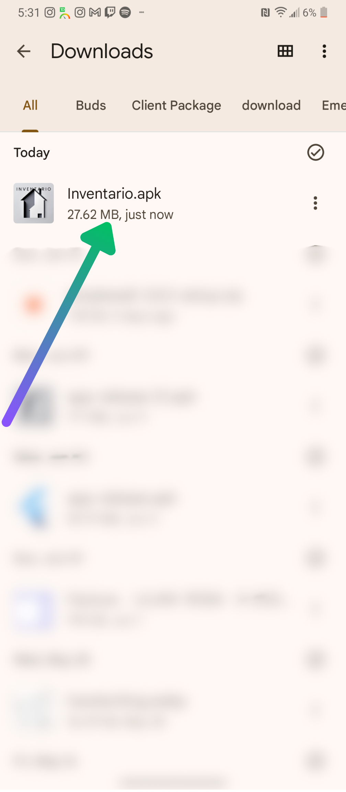
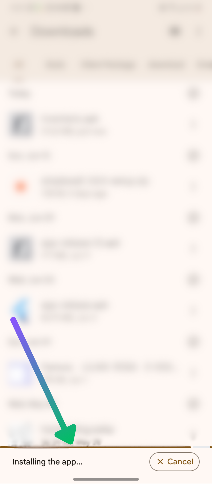
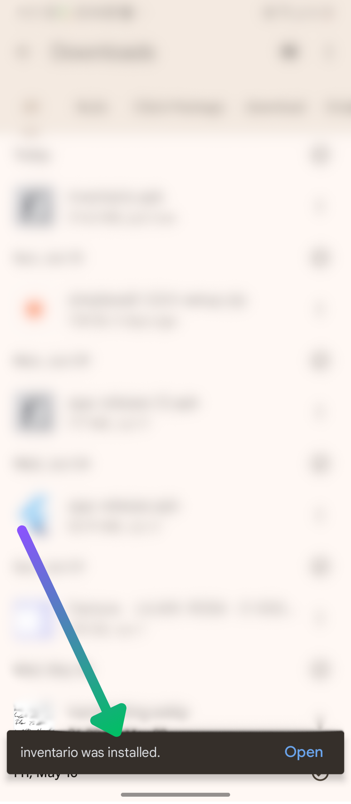
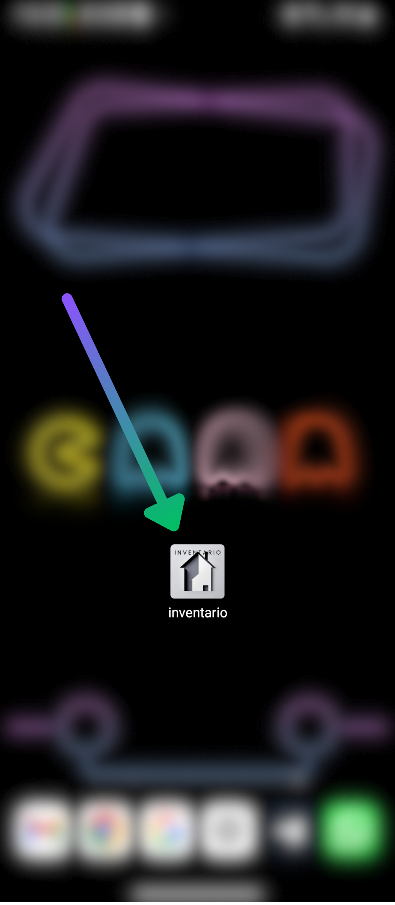
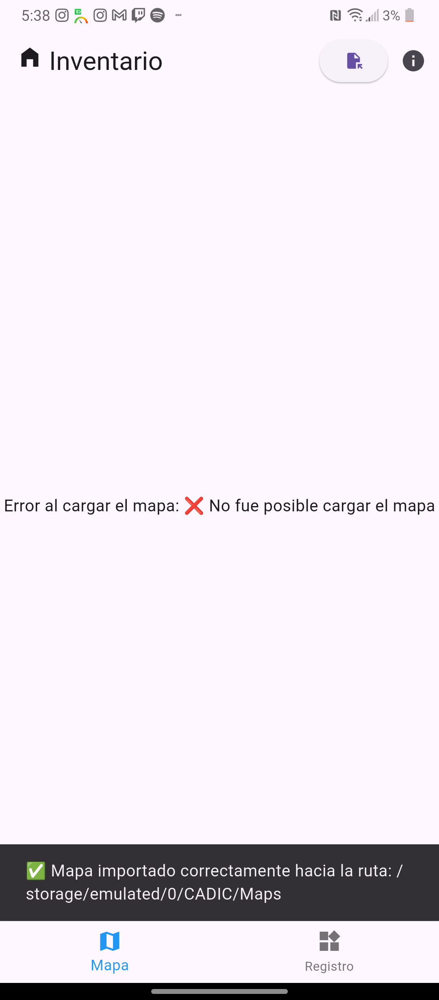

 

 
Inventario 

Manual para el usuario

<!-- TOC --> 

- [Instalación y primeros pasos](#instalación-y-primeros-pasos)
  - [Instalación](#instalación)
  - [Apariencia y Componentes básicos](#apariencia-y-componentes-básicos)
  - [Importación/Exportación](#importaciónexportación)
      - [Importación](#importación)
      - [Exportación de la Base de Datos](#exportación-de-la-base-de-datos)
      - [Limpieza de la Base de Datos](#limpieza-de-la-base-de-datos)
- [Uso del mapa](#uso-del-mapa)
  - [Acceder a la información de un predio desde el mapa](#acceder-a-la-información-de-un-predio-desde-el-mapa)
- [Uso de los formularios](#uso-de-los-formularios)
  - [Subformularios](#subformularios)
  - [Rellenado](#rellenado)
  - [Guardado](#guardado)
  - [Edición](#edición)
  - [Eliminación](#eliminación)
  - [Sobrescritura de datos](#sobrescritura-de-datos)
  - [Marcar un predio como visitado](#marcar-un-predio-como-visitado)
- [Exportación de datos](#exportación-de-datos)
- [Solución a problemas comunes](#solución-a-problemas-comunes)
  - [Más de un mapa en la carpeta de mapas](#más-de-un-mapa-en-la-carpeta-de-mapas)
  - [Cambiar el nombre del encuestador](#cambiar-el-nombre-del-encuestador)
  - [No se muestran los predios en el formato correcto en el mapa](#no-se-muestran-los-predios-en-el-formato-correcto-en-el-mapa)
  - [La aplicación no abre la primera vez](#la-aplicación-no-abre-la-primera-vez)
- [Sección para desarrolladores](#sección-para-desarrolladores)
  - [Formato de entrada de archivos](#formato-de-entrada-de-archivos)
      - [Mapa](#mapa)
      - [Delimitaciones](#delimitaciones)
      - [Servicio de Maestro de Licencias Comerciales.](#servicio-de-maestro-de-licencias-comerciales)
  - [Estructura de la Base de Datos](#estructura-de-la-base-de-datos)
  - [Almacenamiento de campos](#almacenamiento-de-campos)

<!-- /TOC -->

# Instalación y primeros pasos
La aplicación se distribuirá a los usuarios encuestadores en dos versiones, una con un tamaño de alrededor de 200mb y la otra con alrededor de 26mb. Ambas versiones funcionan de igual manera, en lo único que difieren es en que la de mayor tamaño viene con un mapa de la ciudad de managua incluido dentro de la aplicación, por lo que al instalar esta versión, no hará falta importar el mapa por separado, en caso de poder conformarse con el mapa que trae originalmente. En lo que sigue se tratarán ambas versiones de la aplicación como la misma.

## Instalación
El proceso de instalación es bastante fácil, aunque en ocasiones, en versiones de Android puede incluir un paso extra de análisis o escaneo del archivo apk.
En las siguientes instrucciones interactivas, se explica a detalle con imágenes, el proceso de instalación.

<body>

    

        

            
            
Aquí podemos apreciar la aplicación ya descargada. Presionamos sobre ella para comenzar 
                el proceso de instalación

        

        

            
            
Esperamos hasta que se instale la aplicación, debería aparecer una barra de carga informando
                el transcurso de la instalación.

        

        

            
            
Una vez terminada la instalación al ver un mensaje de confirmación, se puede continuar al proceso 
                de configuración. ya dentro de la aplicación.

        

        

            
            
Una vez instalada la aplicación debería aparecer en el dispositivo con el icono del logo de la aplicación.

        

        

            
            
Esta es la primera pantalla dentro de la aplicación. Esta pantalla solamente se verá la primera 
                vez que se entra en la aplicación.

        

        

            
            
 Una vez que se introduce el nombre del encuestador que operará 
                la aplicación en el dispositivo actual y se continúe, el nombre y los apellidos introducidos 
                quedarán registrados en la base de datos de la aplicación, y cada vez que se exporten los datos recogidos, 
                el nombre y los apellidos del encuestador serán adjuntados a esta base de datos exportada. Aunque se utilice la 
                herramienta "Limpiar Base de Datos", los datos del encuestador permanecerán intactos. Si se tiene algún problema con esto, consultar la sección <a href="#cambiar-el-nombre-del-encuestador">Cambiar el nombre del encuestador</a> 

        

        

            
            
Si se tiene la version de la aplicación que no incluye el mapa(la que pesa alrededor de 26 mb), 
                inicialmente la aplicación no tendrá mapa cargado y por ende se mostrará en lugar del mapa, este mensaje de error. 
                En los pasos siguientes se explica como cargar el mapa de manera adecuada.

        

        

            
            
Al entrar por primera vez en la aplicación, se crear una carpeta llamada 'CADIC' dentro del directorio raíz del dispositivo. 
                Esta contiene tres subcarpetas: 'Maps', 'Delimitaciones' y 'Exportado'. Este es el directorio que la aplicación tiene para 
                importar los recursos que necesita y exportar los datos recogidos, por lo tanto, en estas tres subcarpetas estarán el mapa 
                en formato de archivo con extensión '.mbtiles', las delimitaciones, cada una con extensión '.geojson', y última base de datos 
                exportada; en las carpetas 'Maps', 'Delimitaciones' y 'Exportado' respectivamente.
            

        

        

            
            
Para importar un mapa, se deberá proceder de manera manual, colocando el archivo con extensión '.mbtiles' que representa
                el mapa, en la carpeta 'CADIC/Maps' explicada en el paso anterior; o se podrá proseguir con una opción ofrecida dentro 
                de la propia aplicación que se encarga de dejar al usuario seleccionar el mapa del sistema de archivos del dispositivo 
                y automáticamente copiar el archivo para la carpeta adecuada. Para acceder a esta última opción, se deberá primero presionar 
                en el botón que despliega y agrupa las opciones de importación/exportación, este se podrá ver señalado en la imagen.
            

        

        

            
            
Aquí se pueden observar las opciones de importación/exportación de la aplicación. Aquí estarán las funcionalidades de 
                utilidad para importar un mapa, importar una capa de delimitaciones, exportar la base de datos y limpiar la base de datos. 
                En esta ocación utilizaremos la función de importar un mapa. Cuando esta opción es seleccionada, debería mostrarse el selector 
                de archivos del dispositivo, dando la opción de buscar el archivo del mapa de dentro del almacenamiento.
            

        

        

            
            
Luego de haber seleccionado el archivo del mapa desde el selector de archivos, debería salir un mensaje de confirmación de 
                importación en una barra auxiliar con fondo negro cerca de la parte inferior de la pantalla. Si esto no ocurre, es recomendable 
                copiar el mapa manualmente hacia la carpeta 'CADIC/Maps/'.
            

        

        

            
            
Después de haber importado el mapa con la funcionalidad en cuestión, debería haberse copiado y quedado en la carpeta 'CADIC/Maps/' 
                como se muestra en la imagen.
            

        

        

            
            
Al comprobar que el mapa está efectivamente en el lugar dicho. En caso de no haber cerrado la aplicación, se debería hacer, así 
                se cargará el mapa de manera apropiada al reabrirla. Luego de esto, el mapa cargará correctamente como se muestra en la imagen.
            

        

    

## Apariencia y Componentes básicos
**Nombre de la aplicación**: En la esquina superior izquierda de la aplicación, en cualquier momento, saldrá "Inventario" junto a un icono de una casa pequeña.

\
\
**Pestañas `Mapa` y `Registro`**: Todo el tiempo se puede cambiar de pestaña para acceder a la función del mapa o de registro de formularios. La pestaña activa se resaltará en color azul.

\
\
**Botón de Importación-Exportación**: Con este botón accederemos a una lista de opciones de importación/exportación de datos. Estas opciones son: `Importar mapa`, `Importar capa de delimitaciones`, `Exportar BD` y `Limpiar BD`. Este botón está en la esquina superior derecha de la aplicación.

\
\
**Botón de Información**: Este se encuentra en la parte superior derecha de la aplicación, a la derecha del botón de importación/exportación. Este nos dará información de utilidad como ................

\
\
**Mapa**: en la región central de la aplicación, cuando la pestaña `Mapa` está activa, se podrá ver el mapa. Para la navegación sobre este, estarán disponibles los gestos generales de navegación sobre mapas en dispositivos de pantalla táctil, acercamiento/alejamiento/rotación usando dos dedos y desplazamiento usando un dedo.

\
\
**Botón de ubicación**: En el mapa se puede apreciar un botón con un icono de objetivo en la esquina inferior derecha. Este botón se mostrará siempre que el mapa haya sido cargado correctamente y se esté mostrando, y ayuda a llevar la vista del mapa hacia la localización del usuario en tiempo real.

\
\
**Formularios**:
La visa de formularios se mostrará cuando la pestaña 'Registro' esté activa. Aquí se podrán ver los tres subformularios que constituyen la parte principal de la aplicación: Predio, Edificio y Propiedad. No siempre estarán visibles los tres subformularios, esto depende de varias cosas explicadas en la sección [Uso de los formularios](#uso-de-los-formularios).

## Importación/Exportación
Las cuarto opciones de importación/exportación estarán disponibles en una lista de botones que sale al presionar el botón de importación exportación. Estas cuatro opciones se observan a continuación como mismo aparecen en la aplicación:

#### Importación
Tanto en la opción de `Importar Mapa` como para `Importar capa de Delimitaciones`, al presionar en el botón correspondiente, se abrirá el selector de archivos. Podremos escoger, para el caso de un mapa, un archivo con extensión '.mbtiles' y para el caso de las delimitaciones, un archivo con extensión '.geojson'. En caso que haya un mapa ya importado, se quiera importar otro y hayan problemas, consultar la sección [Más de un mapa en la carpeta de mapas](#más-de-un-mapa-en-la-carpeta-de-mapas). Se pueden importar la cantidad de capas de delimitaciones que se deseen, aunque a partir de 4 no serán del todo distinguibles entre ellas por la similitud entre colores que pueda haber. Al importar una o varias capas de delimitación, estas aparecerán en el mapa (si tienen el formato correcto) con el contorno de un color diferente para cada capa(archivo). En el caso de los predios, se representarán de color rojo por defecto y verde en caso de haber sido marcados como visitados (ver sección [Marcar un predio como visitado](#marcar-un-predio-como-visitado)). También en cualquiera de los casos, los predios tendrán un punto en el centro. Estos sirven para acceder a su información al ser presionados (Ver [Uso del mapa](#uso-del-mapa)).
#### Exportación de la Base de Datos
Al seleccionar la opción `Exportar BD`, esta acción se realizará inmediatamente recibiendo un mensaje de confirmación en una barra auxiliar. La ruta de exportación es fija, por lo tanto el archivo que contiene la base de datos exportada siempre estará ubicado en la carpeta 'CADIC/Exportado' en el directorio raíz del dispositivo. El resultado de esta operación deberá crear un archivo llamado 'inventario.db' en la carpeta indicada como se muestra a continuación:

La base de datos al exportarse NO se elimina, por lo tanto, en caso de querer eliminarse, deberá hacerse esto de manera manual con la opción [Limpieza de la BD](#limpieza-de-la-base-de-datos)
#### Limpieza de la Base de Datos
Esta opción limpiará la base de datos, borrando TODOS los datos recogidos sobre los predios, edificios y propiedades. Esta acción no es reversible, por tal motivo se muestra un mensaje de advertencia antes de proseguir con la eliminación para confirmar que el usuario no se equivocó al presionar este botón.

# Uso del mapa
La navegación por el mapa, como ya se explicó, tiene habilitados los gestos que normalmente se usan en la navegación digital cartográfica de forma genérica. 
- Para desplazamiento horizontal y/o vertical, se deberá arrastrar el dedo por el mapa.
- Usando dos dedos sobre el mapa se podrá hacer un acercamiento/alejamiento "pellizcando" la pantalla. 
- También haciendo uso de dos dedos, se puede rotar el mapa, haciendo un gesto de rotación tocando la pantalla. 

En caso de haber importado delimitaciones y que las mismas estén en un formato correcto, estas serán visibles en el mapa, representadas con distintos colores en sus bordes(Ver sección [Importación](#importación)). Las delimitaciones se verán como se aprecia a continuación(ejemplo con color negro):

El ejemplo anterior tiene solo una capa que podría encontrarse delimitando las manzanas de una zona determinada de managua. En el ejemplo siguiente se agregará una capa además de la anterior, pero esta nueva capa tendrá el formato de delimitaciones de predios, en este caso el nombre del archivo cumple con un requisito, que es finalizar el nombre del fichero con "_predios.geojson". En este caso se llama "managua_predios.geojson". De esta manera se pueden identificar los archivos de delimitaciones de predios más fácilmente a la hora de importarlos al mapa o retirarlos de este.

## Acceder a la información de un predio desde el mapa
Si se tiene una capa de predios agregada al mapa, esta se mostrará como se pudo ver anteriormente. El área de cada predio estará representada con sus delimitaciones y al mismo tiempo un punto de color negro en su centro, el cuál al ser presionado, abrirá la información del predio que representa, en la pestaña de formularios.
# Uso de los formularios
El uso de formularios como ya se sabe es la funcionalidad principal de la aplicación. Al rellenar y  guardar un formulario, la información se salva en una base de datos ubicada en el dispositivo, que luego será exportada en un archivo `inventario.db`. Los formularios están disponibles en la pestaña `Registro`. En el área superior se podrá observar el número de `Localización` del predio que se está editando, este es un campo que inicialmente está inhabilitado para editar, pero puede ser habilitado, permitiendo cambiar manualmente el predio al que se está accediendo. Esto se logra al rellenar el campo con el número de localización del predio que se desea editar/consultar:
 
Como se podrá observar, si previamente no se ha introducido de forma manual o seleccionado en el mapa ningún predio, el campo `Localización` tendrá el valor `-1`.
## Subformularios
Existen 3 formularios, Predio, Edificio y Propiedad. Cada uno de ellos recoge información relacionada con la entidad que su nombre indica. Cada uno de ellos está representado visualmente con una barra desplegable y su nombre. Al desplegar un formulario, se podrán ver los campos que lo componen, o sea, los campos que se deben rellenar para hacer un registro de un Predio, un Edificio o una Propiedad; y por último un botón de `Guardar`.
## Rellenado
Cada campo, según su nombre, sugiere qué tipo de datos admite, aunque también se puede determinar si es un campo numérico, de texto, de fecha, imagen o de selección; a partir del tipo de teclado o método de entrada que aparece al intentar rellenarlo:
     
También existen casillas que al marcarlas, se habilitarán otros campos que no estaban disponibles para ser rellenados. Por ejemplo al marcar la casilla `Tiene más patentes comerciales` en el formulario de Propiedad, se activa (y se vuelve obligatorio rellenar) el campo `Número de patente 2`:
 

## Guardado
Para registrar un Predio, un Edificio o una Propiedad en la base de datos, el formulario correspondiente debe tener correctamente rellenados todos los campos obligatorios que contiene, para que al presionar en el botón `Guardar` se almacenen los datos sin problemas.
Para que un formulario sea válido debe cumplir lo siguiente:
- Todos los campos obligatorios están rellenados con el tipo de valor correcto. Por ejemplo, un campo que admite solo valores enteros, no puede tener un número con decimales.
- En caso de estar habilitada una casilla que active nuevos campos, estos deben estar correctamente rellenados también.
- Si se está editando un edificio ya existente(Ver sección [Edición](#edición)), al cambiar el número de localización de un edificio (asociarlo a otro predio), el predio debe estar ya registrado en la base de datos.

**Notas**: 
- Los campos de selección múltiple pueden no tener ninguna opción seleccionada.
- Los campos específicos `Código CIIU actividad primaria` y `Código CIIU actividad complementaria` en el formulario de Propiedad, estarán siempre inhabilitados, o sea, no son rellenables.
## Edición
Para editar una entidad(Predio, Edificio o Propiedad), ya esta debe estar registrada en la base de datos. 
**Predio**: Para editar un predio, solo se tiene que cambiar el número de localización manualmente o simplemente presionar un predio en el mapa y que nos salga su número de localización en el formulario automáticamente. Luego editamos los campos que querramos variar y presionamos en `Guardar`.
**Edificio**: Para editar un edificio se debe primero que todo seleccionar el predio al que pertenece(seleccionándolo en el mapa o manualmente). Por consiguiente, dentro del área desplegada del formulario de Edificio, saldrá la lista de edificios que tiene el predio seleccionado, en forma de cápsulas como las que se observan a continuación: 

Para editar un edificio, solo se debe presionar en la cápsula que representa el edificio deseado. Al seleccionar un edificio, la cápsula del edificio seleccionado se resaltará en un color verde. 

Esto indica que el edificio está siendo editado. Aquí se puede cambiar cualquiera de los campos que estaban rellenados o no, y presionar luego en el botón `Guardar` para modificar los datos. Al presionar este botón, siempre se advertirá y preguntará si se quiere editar verdaderamente el edificio. En caso que se esté seguro, se presiona aceptar en el mensaje que apareció y se guardarán los datos.
**Propiedad**: Para editar una propiedad de un edificio, debe estar seleccionado el predio al cual este edificio está asociado. También debe estar seleccionado el edificio, y al estarlo, se mostrará en la parte de arriba dentro del formulario de propiedad, la lista de propiedades que tiene asociadas el edificio actual seleccionado. De igual manera, para editar una propiedad, se selecciona de esta lista de propiedades y al estar seleccionada una propiedad esta se resaltará en color verde. 
 
## Eliminación
Para eliminar un edificio o una propiedad se puede presionar en la cruz pequeña a la derecha de cada cápsula de la lista de propiedades o edificios. Luego de hacer esto, se eliminará provisionalmente, pero dando cinco segundos para deshacer la eliminación, durante estos 5 segundos, se verá una barra auxiliar que muestra el tiempo que se tiene y el botón `Deshacer`. Si se presiona en dicho botón, ningún cambio habrá ocurrido, en cambio si pasa el tiempo o se deciden eliminar más propiedades o edificios, se eliminarán de inmediato los datos de esta propiedad/edificio.
## Sobrescritura de datos
**Cambiar un edificio de predio o cambiar el número de edificio de un edificio**: Esta funcionalidad permite cambiar un edificio de localización, o sea, de predio. Esto se utiliza para casos en los que hubo un edificio que se agregó al predio equivocado, evitando tener que eliminar el edificio, el cual puede tener muchas propiedades asignadas, que se tendrían que perder. Al seleccionar un edificio de la lista, se podrá ver un nuevo elemento visual, idéntido al de `Localización`, pero dentro del formulario de Edificio. 

Este estará inhabilitado inicialmente pero puede ser habilitado en caso de querer cambiar el edificio actual hacia un predio diferente. La única condición es que este predio ya haya sido registrado anteriormente. Siempre que se intente cambiar un edificio de predio, saldrá un mensaje de advertencia como método de doble confirmación de la acción. Si existe un edificio con el mismo número de edificio que el actual siendo editado, saldrá un mensaje con un aspecto muy parecido advirtiendo esto. 
En caso de que se edite el número de edificio y exista un edificio con este número en el predio; o en caso que se asocie el edificio a otro predio y exista un edificio en este nuevo predio con el mismo número de edificio que el edificio actual; en ambos casos se advertirá lo que ocurre y en caso de aceptar a continuar, se sobrescribirá el edificio que se encuentra en el lugar que ocupará el edificio actual, eliminando de forma permanente este edificio y las propiedades que tenga asociadas. Por lo tanto, al cambiar un edificio de predio, se aconseja primeramente revisar el nuevo predio al que se quiere asociar el edificio y revisar qué números de edificio están ocupados.
**Cambiar el número de local de una propiedad**: Al hacer esto, si existe una propiedad en el mismo edificio con el mismo número de local, se advertirá sobre esto mostrándose un cuadro de diálogo, en caso de aceptar, se sobrescribirá la propiedad anterior, eliminándola de manera irreversible.
## Marcar un predio como visitado
En la parte más abajo de la vista de los formularios, se podrá ver el botón `Predio Visitado!`:

Este botón es una herramienta utilizada meramente por comodidad para el encuestador. Hace que el predio actual se marque en el mapa de color verde. Recordar que los predios están representados de color rojo inicialmente. Esta herramienta debe ser utilizada dentro de la misma ejecución de la aplicación, o sea, que al cerrarse la aplicación y volverse a abrir, seguirán señalado los predios que se marcaron como visitados, pero si se finaliza el proceso de la aplicación y se reinicia, ya no aparecerán marcados en el mapa y se tendrán que marcar desde el principio. Esto ocurre también si el dispositivo decide que debe cerrarla por tener muchas otras aplicaciones o archivos abiertos. 
  
# Exportación de datos
Como ya se decía anteriormente, el flujo de la aplicación consiste en: insertar datos, exportarlos, y luego limpiar los datos. Por ende, exportar la base de datos es fundamental. Esto se realiza desde `botón de importación/exportación > Exportar BD`. Al presionar sobre esa opción, directamente se exportará la base de datos `inventario.db` hacia la carpeta 'CADIC/Exportado' en la raíz del dispositivo.
# Solución a problemas comunes
## Más de un mapa en la carpeta de mapas
## Cambiar el nombre del encuestador
## No se muestran los predios en el formato correcto en el mapa
## La aplicación no abre la primera vez
La aplicación puede que no abra la primera vez por dos motivos, uno de ellos es que no se le ha dado permiso para manejar el almacenamiento y escritura de archivos. Esto se soluciona accediendo a `Configuración > Aplicaciones > Permisos > Administrador de permisos > Archivos`. Aquí se mostrarán las aplicaciones que pueden acceder a los archivos. Si no esta Inventario en la lista, asegúrate de que esté. Puede que la lista de aplicaciones que pueden acceder a los archivos no se muestre completa y se tenga que ir a acceder a la opción: `Ver más aplicaciones que pueden acceder a los archivos`. 
El otro motivo por el cuál puede que no se muestre la aplicación es incompatibilidad con esta dada por versiones de Android personalizada por distribuidores o marcas específicas. Por lo general en estas versiones hay una ausencia de los servicios de Google (GMS) que son los que proveen la Google Play Store, Gmail, Google Maps, YouTube y todos los demás servicios de Google

# Sección para desarrolladores
## Formato de entrada de archivos
#### Mapa
#### Delimitaciones
#### Servicio de Maestro de Licencias Comerciales.
## Estructura de la Base de Datos
## Almacenamiento de campos

